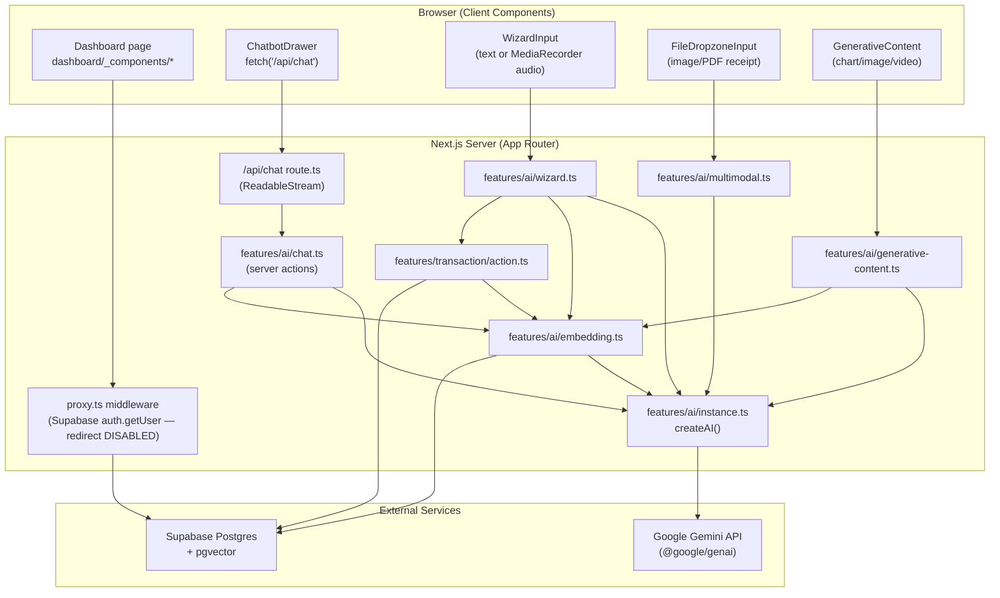
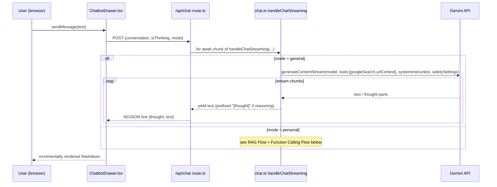
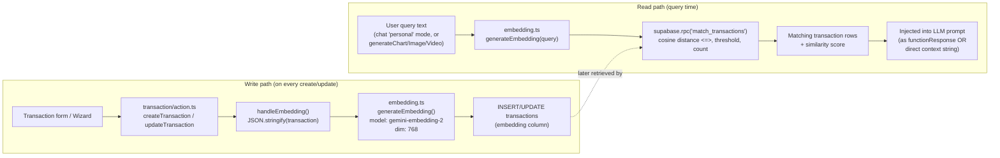
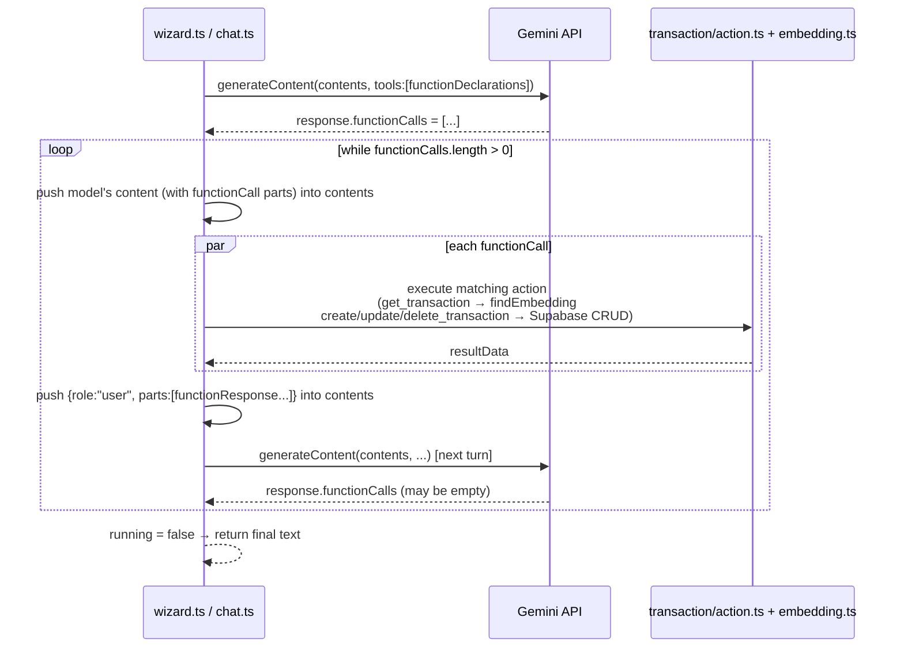
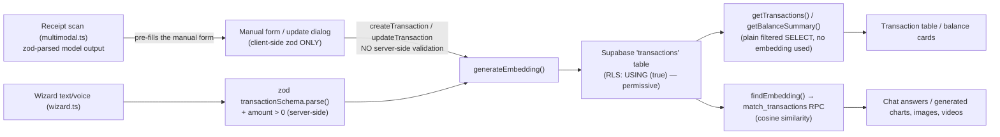
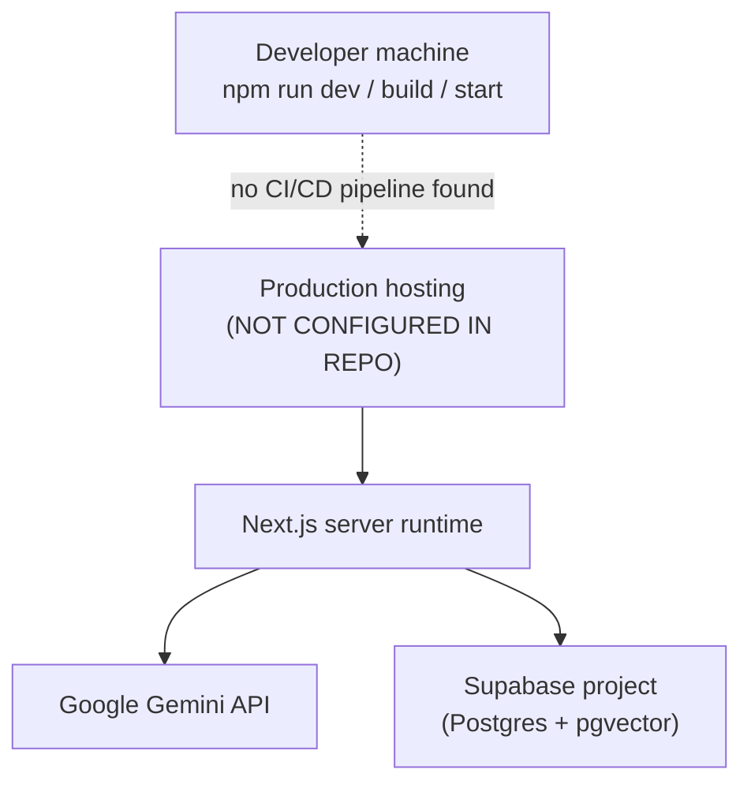

# Architecture

Sections 1–6 are drawn directly from the code paths in [fina-app](../), and they include no hypothetical components. Section 7 is an assessment with a recommended target, and it is labeled as such.

**Revision:** v2. The data-flow diagram was corrected, and section 7 was added. The code described is commit `82db444`.

## 1. System Architecture

Key structural facts this diagram encodes:

- There is exactly one HTTP API route ([src/app/api/chat/route.ts](../src/app/api/chat/route.ts)); every other AI/DB operation is a Next.js Server Action called directly from a client component.
- Every AI feature funnels through the single `createAI()` factory in [instance.ts](../src/features/ai/instance.ts) — there is no per-feature client configuration and no provider abstraction.
- The middleware (`proxy.ts`) computes the authenticated user but its redirect-to-login branch is commented out (see [src/lib/supabase/proxy.ts](../src/lib/supabase/proxy.ts) lines 39–43) — drawn here to make explicit that "Proxy" does *not* currently gate access.

## 2. AI Request Flow (streaming chat, both modes)

## 3. RAG Flow

Two distinct integration styles exist for the read path, both shown as valid in the code:

1. **Tool-mediated retrieval** — [chat.ts](../src/features/ai/chat.ts) personal mode exposes `get_transaction` as a Gemini function the model decides to call; the function's execution runs `findEmbedding`.
2. **Pre-fetch retrieval** — [generative-content.ts](../src/features/ai/generative-content.ts) always calls `findEmbedding` before constructing the prompt, regardless of whether the model would have asked for it.

## 4. Function/Tool-Calling Flow

This loop is duplicated (not shared) between [chat.ts](../src/features/ai/chat.ts) `handleChatStreaming` (streaming variant, read-only tool) and [wizard.ts](../src/features/ai/wizard.ts) `handleWizardTools` (non-streaming variant, full CRUD tools). See [09-ai-agent-tools.md](09-ai-agent-tools.md) for the duplication as an audit finding.

## 5. Data Flow (transaction lifecycle)

**Correction (v2):** v1's diagram routed every write through `transactionSchema.parse()`. That was wrong. Only the wizard path validates on the server.
- The manual create and update forms validate with a local zod schema in the browser only.
- The `createTransaction` and `updateTransaction` Server Actions then spread whatever payload they receive directly into the database, with no server-side check (AUDIT-REPORT SEC-7).

Note: the receipt-scan path (`extractReceiptData`) returns an extracted transaction to the form for the user to review — it does **not** call `createTransaction` itself (the call is commented out in [multimodal.ts](../src/features/ai/multimodal.ts), line 68–69). Persistence for that path only happens if the user then submits the form.

## 6. Deployment Architecture

There is genuinely nothing more to draw here: no Dockerfile, no `vercel.json`, no GitHub Actions workflow, and no infra-as-code exist in the repository. `next.config.ts` sets only `reactCompiler: true`. See [17-deployment.md](17-deployment.md) for what would need to be added.

## 7. Architecture assessment and recommended layering (assessment, not current code)

| Quality | Verdict | Evidence |
|---|---|---|
| Coherent | **Yes, for its size.** | Features are grouped by domain (`features/ai`, `features/transaction`), with one clear entry point per UI feature. |
| Maintainable | **Partly.** | The tool loop is duplicated (COR-3); model IDs are scattered (COR-4); prompts are retyped rather than shared (COR-7); there are two `cn` implementations (COR-15). |
| Reusable | **Low.** | Business rules are split between the Server Actions and the switch statements inside the AI loops. Tool definitions exist only in Gemini-specific form. |
| Scalable | **Low.** | Balances are aggregated in application code (COR-8); there is no vector index; video polling blocks the request; there is no tenant isolation. |
| Provider-independent | **No.** | Every file in `features/ai/*` imports `@google/genai`. Even the business write path (`createTransaction`/`updateTransaction`) can't succeed without Gemini, because it embeds synchronously. |

### Where provider coupling actually is

| Layer (today) | Coupled to Gemini? | Notes |
|---|---|---|
| `instance.ts` | Yes | Acceptable: this is where the coupling *should* live. |
| `chat.ts`, `wizard.ts`, `multimodal.ts`, `generative-content.ts` | Yes | Prompts, tool dispatch, and response parsing are mixed together. |
| `function-transaction.ts` | Yes | Tool schemas are written with the Gemini `Type` enum rather than neutral zod or JSON Schema. |
| `embedding.ts` | Yes | Tied to `gemini-embedding-2` and 768 dimensions. Changing the model means re-embedding every row. |
| `transaction/action.ts` | **Indirectly** | Its `handleEmbedding` call makes every write depend on Gemini. |
| `transaction-constant.ts`, `lib/utils.ts` | No | These are provider-neutral. |

### Recommended separation

| Layer | Responsibility | Must not depend on | Seed in current code |
|---|---|---|---|
| **AI provider layer** | Adapters implementing `LlmPort`, `EmbeddingPort`, `ImagePort`, `VideoPort` | Business logic, UI | `instance.ts` |
| **AI orchestration layer** (API mode only) | Prompts, the tool-calling loop, streaming, persona | Any concrete provider (goes through the ports), and the database directly | The loops in `chat.ts` and `wizard.ts` |
| **Tool layer** | Provider-neutral registry: tool name, zod schema, handler, annotations (read-only or destructive). Rendered into Gemini function declarations *or* MCP tools. | Any provider SDK | `function-transaction.ts` plus the two `switch` dispatchers |
| **Business logic** | Validation, rules (amount > 0, category allow-list), ownership checks, calculations (balance, breakdown) | Any AI provider, Next.js | Parts of `action.ts` and the zod checks inside `wizard.ts` |
| **Data layer** | User-scoped repository, pgvector search | Business rules | Supabase calls in `action.ts` and `embedding.ts` |
| **MCP layer** (future) | MCP server adapter: authentication, rate limits, audit log, exposing the tool layer and resources | **The orchestration layer and `LlmPort`** (no LLM inside MCP) | None |

The target diagram is in [19-mcp-readiness.md](19-mcp-readiness.md#target-layering-recommended-not-implemented). The mode comparison is in [20-api-vs-mcp-architecture.md](20-api-vs-mcp-architecture.md).
