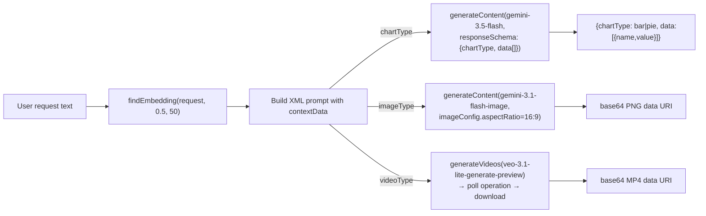

# Content Generation

## Purpose

Turn a free-text user request plus the user's own transaction history into a dashboard artifact: a chart, an image, or a short video. Implemented entirely in [src/features/ai/generative-content.ts](../src/features/ai/generative-content.ts), surfaced by [generative-content.tsx](../src/app/dashboard/_components/generative-content.tsx).

## Architecture

All three generators share one shape:

1. `findEmbedding(request, 0.5, 50)` — RAG pre-fetch of up to 50 semantically relevant transactions at a fixed 0.5 similarity threshold.
2. Build a `contextData` string — either the joined JSON of matched transactions, or a fixed "no transactions found" sentence.
3. Build an XML-tag prompt (role/input/instruction/context/constraints) embedding `contextData` and the current ISO date.
4. Call a different Gemini model per output type.
5. Parse/shape the model response for the specific medium.

## Chart generation (`generateChart`)

- Model: `gemini-3.5-flash`, `responseMimeType: "application/json"`, explicit `responseSchema` (object with `chartType: enum[bar,pie]` and `data: [{name, value}]`).
- Grouping rules are specified in the prompt text itself (group by category for expense composition, by date for trends, by type for income-vs-expense comparisons, top-10 + "Others" bucket) — this logic is delegated entirely to the model; there is no server-side aggregation/grouping code.
- Output consumed by `recharts` `BarChart`/`PieChart` in [generative-content.tsx](../src/app/dashboard/_components/generative-content.tsx), values formatted via `convertToIDR()`.

## Image generation (`generateImage`)

- Model: `gemini-3.1-flash-image`, `imageConfig: { aspectRatio: "16:9" }`.
- No `responseSchema` (not applicable to image output); the prompt asks for a "bento grid style" infographic.
- Response parsing walks `candidates[0].content.parts` looking for `part.inlineData`, builds a `data:<mime>;base64,<data>` URI.
- Rendered via `next/image` with a fixed `1920x1080` width/height regardless of actual generated dimensions.

## Video generation (`generateVideo`)

- Model: `veo-3.1-lite-generate-preview`, called via `ai.models.generateVideos({model, prompt})` — a long-running operation, not a single synchronous call.
- Polling loop: `while (!operation.done) { await sleep(10_000); operation = await ai.operations.getVideosOperation({operation}) }` — unbounded; no timeout or max-attempts guard.
- On completion, the video is downloaded server-side to `path.join(os.tmpdir(), \`temp-video-${Date.now()}.mp4\`)` via `ai.files.download`, then read back into memory and re-encoded as a base64 data URI to return to the client.
- **The downloaded temp file is never deleted** (no `fs.unlink`/`fs.rm` call after reading) — see [AUDIT-REPORT.md](AUDIT-REPORT.md).
- Prompt caps requested duration at "Maximum video duration is 10 second" as an instruction to the model — there is no code-level enforcement of this limit.

## Inputs / Outputs summary

| Function | Input | Output | Failure mode |
|---|---|---|---|
| `generateChart` | request string | `{chartType, data}` | Throws `"Failed to generate chart"` if `response.text` is empty |
| `generateImage` | request string | base64 PNG data URI (or `""` if no `inlineData` part found) | Throws if no candidates/parts at all |
| `generateVideo` | request string | base64 MP4 data URI | Throws `"Failed to generate video"` if no generated video in the operation response |

## Error handling

Each function throws a generic `Error` with a fixed string on failure; none retry, none distinguish "the model returned nothing" from "the API call failed" from "the RAG pre-fetch failed" (a `findEmbedding` failure — e.g. Supabase RPC error — propagates as its own unrelated error, `"Failed to perform vector search."`, from [embedding.ts](../src/features/ai/embedding.ts)).

## Security considerations

- All three generators embed raw user-supplied request text and raw stringified transaction rows directly into the prompt — no sanitization. See [15-security.md](15-security.md).
- `generateVideo`'s temp-file write path uses `os.tmpdir()` — on typical serverless hosts this is ephemeral and instance-local, which is functionally fine for a single request/response cycle but means the leaked temp files (see above) can only be cleaned by container recycling, not by the app.
- Video/image payloads are returned as base64 inline data through a Server Action response, not as a URL — for large videos this could approach Server Action response-size limits; there is no size check in the code.

## Limitations

- No caching of generated content — every request regenerates from scratch, including a fresh embedding search.
- No user control over the RAG threshold/count for generative content (hardcoded `0.5`/`50`).
- No content moderation/safety settings are passed to any of the three generator calls (unlike the chat feature — see [05-prompt-engineering.md](05-prompt-engineering.md)).
