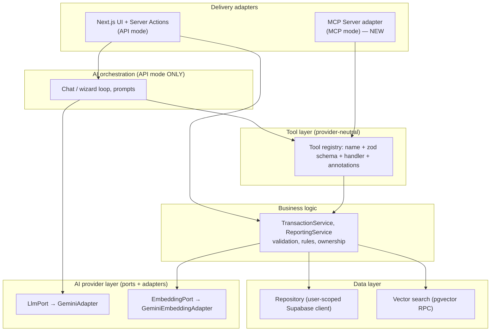

# MCP Readiness Assessment

> **Status: MCP is NOT implemented.** The repository has no MCP server, no MCP SDK dependency, no tool manifest, and no connector code. This document assesses how ready the *existing* code is for a future MCP server. It does not describe anything that runs today.

**Revision:** v2. Restructured around the separation between **AI capabilities** and **business capabilities**.

## Guiding principle

In MCP / connector mode, the customer's Claude is the reasoning engine, and the application is a provider of business capabilities:

```
Customer Claude            reasoning, planning, language, visualization, final answer
       ↓  MCP (tools / resources / prompts)
Application MCP Server     authentication, authorization, validation, business rules
       ↓
Business capabilities      transaction CRUD, search, reporting, calculations
       ↓
Database / RAG / external APIs
```

**The MCP server should not contain an LLM.** Suppose an MCP tool called Gemini (or any LLM) to generate text, reason, summarize, or design output. That would:
- put the inference cost back on the provider, which defeats the business goal of MCP mode
- duplicate reasoning that the customer's Claude already does better, because it has the conversation context
- add a second prompt-injection surface
- make tool output non-deterministic and hard to audit

The one reasoned exception is **embedding generation** for semantic search (see B3 below). It is a narrow retrieval computation, not generative reasoning, and it is optional.

---

## A. AI capabilities — the customer's Claude owns these

These are what the current app does *with Gemini*. In MCP mode, none of them should become an MCP tool. Claude does the work itself using the business tools in section B.

| AI capability | Current implementation | Owner in MCP mode | What the MCP server provides instead |
|---|---|---|---|
| Conversational financial advice ("Finabot" persona) | `generalChat` in [chat.ts](../src/features/ai/chat.ts) | Claude | An optional **MCP prompt** (`financial_advisor`) carrying the persona and rules. The customer chooses to use it; the server runs no model. |
| Answering questions about the user's own data (personal mode) | `handleChatStreaming` personal branch plus the `get_transaction` tool loop | Claude | B1, B2, B3, and B4 as tools. Claude runs its own tool loop. |
| Summarization and financial reasoning | The Gemini prompts' workflow steps | Claude | Accurate numbers from the deterministic tools (B4, B5), so Claude reasons over correct figures and doesn't do the arithmetic itself. |
| Planning multi-step actions ("find it, then update it") | The prompt instruction in [wizard.ts](../src/features/ai/wizard.ts) plus the manual loop | Claude | Tools that each do one clear thing, and server-side ownership checks. |
| Text or voice → structured transaction | `handleWizardTools` (text and audio) | Claude (voice is transcribed by the Claude client, if it supports voice) | `create_transaction` with a strict schema. The server validates; Claude does the extraction. |
| Receipt image/PDF → structured transaction (vision) | `extractReceiptData` in [multimodal.ts](../src/features/ai/multimodal.ts) | Claude (it reads the image the customer attaches) | `create_transaction`, plus the categories resource so Claude picks a valid category. |
| Chart design (choosing bar vs. pie, how to present it) | The model decides in `generateChart` | Claude (it can render a chart or table in its own client) | B5 `get_spending_breakdown`, which returns deterministic aggregated rows. |
| Image generation (infographic) | `generateImage` | Claude or the customer's tools; out of scope for the server | Nothing. The data comes from B4 and B5. |
| Video generation | `generateVideo` | Out of scope for the server | Nothing. This is the most expensive capability, and it should never run on the provider's bill in MCP mode. |

**Conclusion for section A:** the capabilities in `chat.ts`, `wizard.ts`, `multimodal.ts`, and `generative-content.ts` are classified **NOT SUITABLE AS MCP TOOL**. What these files contain that *is* worth keeping — prompts, category rules, business rules — moves into either business-layer validation (section B) or an optional MCP prompt.

## B. Business capabilities — expose these through MCP

These are deterministic, need authorization, and depend on the data. They are what the customer is actually paying the provider for.

### B1. `list_transactions` (tool)

- **Can it be a tool?** Yes. **Should it?** Yes. It is the core read path.
- **Existing code:** `getTransactions` in [transaction/action.ts](../src/features/transaction/action.ts). It pages results and searches the description with a case-insensitive text match (`ilike`).
- **Input:** `{ date_from?, date_to?, type?, category?, min_amount?, max_amount?, text?, limit (≤100), cursor? }`. These are structured filters; Claude turns natural language into them.
- **Output:** `{ items: Transaction[] (id, date, type, category, amount, description), next_cursor, total }`. The embedding column is never returned.
- **Authentication:** an OAuth access token mapped to a user.
- **Authorization:** read access to the user's own transactions.
- **Tenant isolation:** the query runs with the user-scoped Supabase session, and RLS enforces `auth.uid() = user_id`. There is no service-role key on this path.
- **Server-side logic:** filter validation, the page-size cap, sorting.
- **Claude's job:** interpreting "what did I spend on food last month?" into filters.
- **Refactoring needed:** add the structured filters, which `getTransactions` has only partly; add auth; and fix SEC-1 and SEC-2.

### B2. `get_transaction` (tool)

- **Can it / should it?** Yes, both. Update and delete need to confirm the exact record first.
- **Existing code:** none. The current `get_transaction` is actually semantic search (B3).
- **Input:** `{ id: uuid }`
- **Output:** one `Transaction` for the caller, or a not-found result.
- **Authorization and isolation:** same as B1. A row owned by someone else looks exactly like "not found".
- **Refactoring needed:** new function, but trivial.

### B3. `search_transactions` (tool, semantic, optional)

- **Can it be a tool?** Yes. **Should it?** Optional. B1's structured filters answer most questions more precisely. Offer this for fuzzy lookups such as "that coffee place last week".
- **Existing code:** `findEmbedding` in [embedding.ts](../src/features/ai/embedding.ts) and the `match_transactions` function in [setup-vector.sql](../migrations/setup-vector.sql).
- **Input:** `{ query: string (≤500 chars), limit (≤50) }`. The threshold is fixed on the server, not set by the caller; today the caller can set it (SEC-10).
- **Output:** a list of `Transaction` plus a `similarity` score.
- **Model use:** the server has to embed the query, which is a small cost the provider pays. This is the only model call the MCP server makes. It must go through a provider-neutral `EmbeddingPort` interface, not a direct `@google/genai` call.
- **Tenant isolation:** `match_transactions` runs as the caller (`SECURITY INVOKER`) with the user session, so RLS applies once it is fixed. The function should also keep an explicit `user_id` filter as defense in depth.
- **Refactoring needed:** decouple embedding from Gemini, fix the threshold on the server, and add a vector index before multi-tenant scale.

### B4. `get_balance_summary` (tool; could also be a resource)

- **Can it / should it?** Yes, both. It is a business calculation, so the server should compute it rather than Claude.
- **Existing code:** `getBalanceSummary` in [action.ts](../src/features/transaction/action.ts).
- **Input:** `{ date_from?, date_to? }`
- **Output:** `{ total_income, total_expense, savings, currency: "IDR", period }`
- **Authorization and isolation:** same as B1.
- **Refactoring needed:** move the calculation into a SQL aggregate (COR-8), and add the date filter.

### B5. `get_spending_breakdown` (tool)

- **Can it / should it?** Yes, both. It replaces the grouping and aggregation that `generateChart` currently asks Gemini to do, which is non-deterministic arithmetic done by an LLM.
- **Existing code:** none in deterministic form. The logic exists only as prompt instructions in [generative-content.ts](../src/features/ai/generative-content.ts): group by category, date, or type; take the top 10; put the rest in "Others".
- **Input:** `{ group_by: "category" | "month" | "day" | "type", type?, date_from?, date_to?, top_n? (≤20) }`
- **Output:** `{ groups: [{ key, total, count }], others_total, currency }`
- **Claude's job:** choosing the grouping, picking the chart type, and rendering or explaining the result.
- **Refactoring needed:** new SQL RPC or query plus auth. This is the clearest example of moving logic out of a prompt and into business logic.

### B6. `create_transaction` (tool, write)

- **Can it / should it?** Yes, both.
- **Existing code:** `createTransaction` in [action.ts](../src/features/transaction/action.ts), the `createTransactionDeclaration` schema in [function-transaction.ts](../src/features/ai/function-transaction.ts), and `transactionSchema` in [transaction-constant.ts](../src/constants/transaction-constant.ts).
- **Input:** `{ amount > 0, type, category ∈ CATEGORIES, description (≤500), date (YYYY-MM-DD) }`, validated with a strict zod schema.
- **Output:** the created `Transaction`, including its `id`.
- **Authorization:** write access to the user's own transactions. `user_id` is always set on the server, never taken from input.
- **Server-side logic:** validation, the positive-amount rule, the category allow-list, and embedding (done afterwards, and not allowed to block the write).
- **Refactoring needed:** fix SEC-2 and SEC-7, and make embedding asynchronous or tolerant of failure.

### B7. `update_transaction` / B8. `delete_transaction` (tools, write, destructive)

- **Can they / should they?** Yes, both.
- **Existing code:** `updateTransaction` and `deleteTransaction` in [action.ts](../src/features/transaction/action.ts).
- **Input:** `{ id, ...partial fields }` / `{ id }`
- **Output:** the updated `Transaction` / `{ deleted: true, id }`
- **Authorization:** the query must require both `id = ?` **and** that the row belongs to the caller. Today only `id` is checked (SEC-7).
- **Safety:** declare the MCP tool annotations `destructiveHint: true` and `idempotentHint` so the client can ask for confirmation. The "call get before you update or delete" rule now belongs to Claude; the server still enforces ownership.

### B9. `categories` (resource)

- **Should it be a resource?** Yes. It is static reference data. **It is MCP READY today.**
- **Existing code:** `CATEGORIES` in [transaction-constant.ts](../src/constants/transaction-constant.ts).
- **URI:** `fina://categories`. **Output:** `string[]`. Authentication is optional, because the data isn't sensitive.

### Optional resources

- `fina://transactions/recent` — read-only context the client can attach.
- `fina://schema/transaction` — the JSON Schema of a transaction, generated with `z.toJSONSchema`, which the repo already uses in `handleWizardInput`.

---

## Answers to the 11 readiness questions

1. **Which functions are tightly coupled to an AI provider?** Every file in `src/features/ai/*` imports `@google/genai` types and calls it directly. Two business write actions are also coupled indirectly: `createTransaction` and `updateTransaction` call `generateEmbedding` synchronously.
2. **Which are provider-independent?** `getTransactions`, `getBalanceSummary`, `deleteTransaction`, `transactionSchema`, `CATEGORIES`, and `convertToIDR`.
3. **Which could become MCP tools?** B1–B8. None of the section A capabilities should.
4. **Which data could become MCP resources?** Categories (B9), the transaction schema, and optionally recent transactions and the balance summary.
5. **Which business logic stays with the application?** Validation, the positive-amount rule, the category allow-list, `user_id` assignment, ownership checks, aggregation (B4, B5), embedding and vector search, rate limits, and audit logging.
6. **Which reasoning stays with the client?** Intent parsing, turning natural language into filters, planning multiple steps, extracting data from receipts and voice, choosing and rendering visualizations, advice, and the final answer.
7. **What refactoring is required?** See the target layering below. In order:
   1. Fix SEC-1, SEC-2, SEC-3, and SEC-7.
   2. Extract a provider-free business layer.
   3. Put embedding behind a port and make it non-blocking.
   4. Implement B4 and B5 in SQL.
   5. Build a tool layer with zod schemas.
   6. Add an MCP adapter.
8. **What authentication is required?** OAuth 2.1 for a remote MCP server, following the MCP authorization spec. Tokens are issued per user (or per user and tenant). A new remote MCP server needs its own authorization-server metadata and consent flow; Supabase Auth could be the identity provider. None of this exists yet.
9. **What authorization is required?** Scope the Supabase client to the user (from a token exchange) so RLS enforces isolation. Add explicit ownership predicates in the business layer. Optionally, use scopes such as `transactions:read` and `transactions:write` so a customer can connect in read-only mode.
10. **What multi-tenant issues exist?** There is no enforced tenant concept at all (SEC-1, SEC-2). `CATEGORIES` is one global constant, with no per-tenant taxonomy. Nothing enforces per-tenant quotas. Vector search has no index and no tenant partitioning.
11. **What customer onboarding would be required?** Signup, the OAuth consent screen, instructions for adding the connector to Claude or Claude Code (the server URL), a documented tool and resource contract, a data-processing disclosure (data is sent to the embedding provider), and a per-customer usage view.

## Target layering (recommended; not implemented)



Notice the arrows:
- **The MCP server never depends on the orchestration layer or on `LlmPort`.** Only API mode uses an LLM. That is exactly the no-"LLM inside MCP" rule.
- **The tool layer is shared by both modes.** In API mode, it is rendered into Gemini function declarations. In MCP mode, it is rendered into MCP tool definitions.
- **The seed of the tool layer already exists.** It is split across the declarations in `function-transaction.ts` and the `switch` dispatch statements in `wizard.ts` and `chat.ts`.

## Classification summary

| Capability | Classification |
|---|---|
| Categories resource (B9) | MCP READY |
| list / get / create / update / delete transactions (B1, B2, B6, B7, B8) | MCP READY WITH REFACTORING (depends on fixing SEC-1, SEC-2, SEC-3, SEC-7) |
| Balance summary (B4) | MCP READY WITH REFACTORING |
| Semantic search (B3) | MCP READY WITH REFACTORING (decouple embedding; fix the threshold on the server) |
| Spending breakdown (B5) | REQUIRES ARCHITECTURAL CHANGE (logic currently lives in an LLM prompt; must become SQL) |
| Chat advisor, wizard, receipt extraction, chart design, image and video generation (section A) | NOT SUITABLE AS MCP TOOL (belongs to the customer's Claude) |
| Authentication, authorization, and tenancy | REQUIRES ARCHITECTURAL CHANGE (prerequisite for everything above) |

The per-capability registry is in [MCP-CAPABILITY-REGISTRY.md](MCP-CAPABILITY-REGISTRY.md). The mode comparison is in [20-api-vs-mcp-architecture.md](20-api-vs-mcp-architecture.md).
