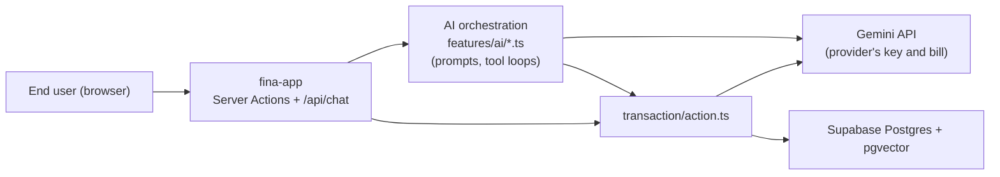
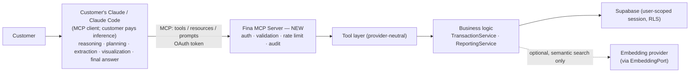
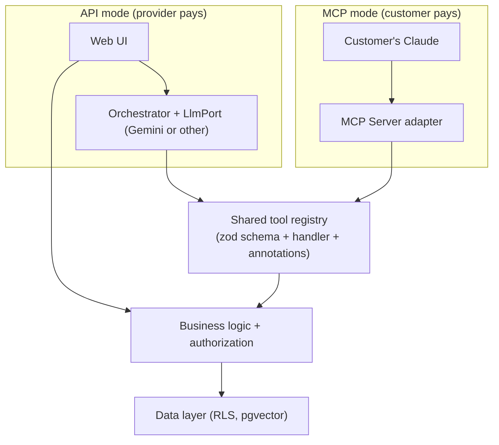

# API Mode vs. MCP Mode Architecture

**Revision:** v2.
- **Model A (API mode)** describes what [fina-app](../) actually is today.
- **Model B (MCP mode)** is a design proposal. **None of it is implemented.**
- **Model C (hybrid)** is the recommended target.

## Model A — API mode (current, implemented)

- **The provider controls everything:** the model, prompts, persona, and UX. The provider also pays for all inference.
- **Orchestration is mixed into the business logic.** Tool dispatch lives inside `chat.ts` and `wizard.ts`, and the business write actions call Gemini directly for embeddings.
- The data flow is detailed in [01-architecture.md](01-architecture.md).

## Model B — MCP / connector mode (proposed, not implemented)

**Design rules for Model B:**

1. **The MCP server contains no LLM.** It never generates text, images, video, or summaries. Claude does all of that.
2. **Tools return data, not prose.** Results are structured, deterministic, and paginated. That makes them auditable, cheap, and safer against prompt injection.
3. **Business calculations are server-side and deterministic.** Balances and breakdowns are computed in SQL, so Claude reasons over correct numbers instead of doing arithmetic.
4. **Embedding is the only allowed model call,** and only for semantic search. It is optional, runs behind a port, and must not block writes.
5. **The persona becomes an optional MCP prompt**, not a hidden system instruction. The customer's Claude chooses whether to use it.

## Side-by-side

| Aspect | Model A (current) | Model B (proposed) |
|---|---|---|
| Who pays for reasoning inference | Provider (Gemini key) | Customer (their Claude plan or API key) |
| Who pays for embeddings | Provider | Provider (small, per write and per search) |
| Where reasoning happens | Server (Gemini prompts in `features/ai/*`) | Customer's Claude |
| Where business rules live | Scattered: action.ts, plus zod checks inside wizard.ts's tool switch | Business layer, called by the MCP tool layer |
| Tool definitions | Gemini `FunctionDeclaration` (`Type` enum) in [function-transaction.ts](../src/features/ai/function-transaction.ts) | Provider-neutral zod schemas, rendered as MCP tool definitions (JSON Schema) |
| Transport | Server Actions plus one streaming Route Handler | MCP over Streamable HTTP (remote) |
| Authentication | Supabase cookie session (**not enforced**, SEC-3) | OAuth 2.1 token per MCP client and user (not built) |
| Tenant isolation | **None** (SEC-1, SEC-2) | User-scoped DB session with RLS, plus explicit ownership predicates |
| Charts, images, video | Server calls Gemini | Server returns aggregated data; Claude visualizes. Image and video are out of the server's scope |
| Receipt / voice extraction | Server calls Gemini with the uploaded file | Claude reads the file or voice in its own client, then calls `create_transaction` |
| Provider control over quality | High | Limited to tool design, schemas, descriptions, and prompts offered |

## Model C — Hybrid (recommended target)

Run both modes on **one shared tool layer and business layer**:

- **Business rules are written once**, so the two modes cannot drift apart.
- **Each mode is sold differently:** API mode is a turnkey consumer app priced to cover inference; MCP mode is a data and actions subscription where the customer brings their own Claude.
- **AI features that exist only in the web UI** (Finabot, video insights) stay in the API-mode orchestrator. They are never added to the MCP server.

## What must be true before Model B is safe

None of these exist today:

1. SEC-1, SEC-2, SEC-3, and SEC-7 are fixed ([AUDIT-REPORT.md](AUDIT-REPORT.md)).
2. A provider-free business layer exists, and `createTransaction` no longer requires Gemini to succeed.
3. A shared tool registry exists, extracted from `function-transaction.ts` and the two `switch` dispatchers.
4. The OAuth authorization flow for the MCP server exists.
5. Every tool has rate limits, result-size caps, and an audit log.
6. `get_spending_breakdown` and `get_balance_summary` are implemented in SQL.

For the full capability analysis, see [19-mcp-readiness.md](19-mcp-readiness.md) and [MCP-CAPABILITY-REGISTRY.md](MCP-CAPABILITY-REGISTRY.md).
