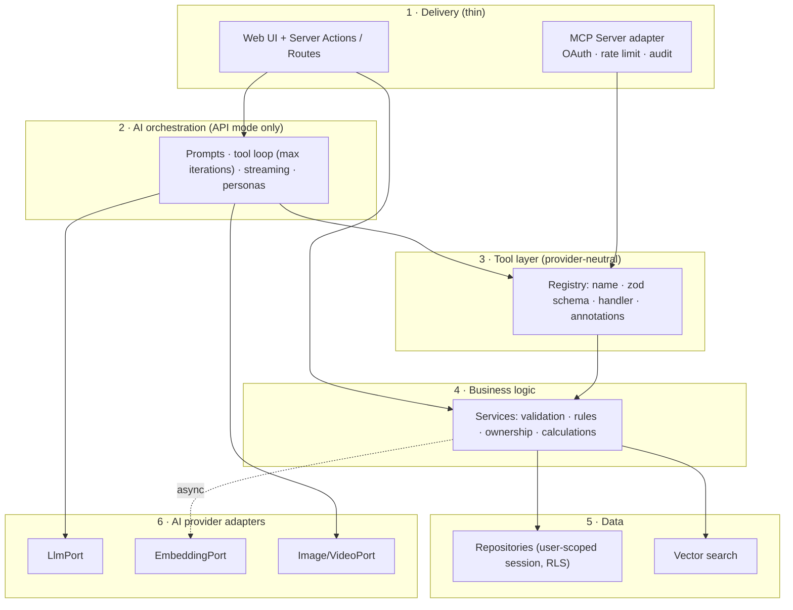

# AI Apps Engineering Standard v1.0

**Question this answers:** *"If I start a new AI application tomorrow, how should I architect it?"*

**Where it comes from:**
- The course curriculum.
- The verified implementation in [fina-app](../): what worked, and what the audit found.
- The production and MCP analysis in this docs set.

**How to use it:** this is the normative summary. The evidence and details live in the linked documents. Where the standard diverges from fina-app, fina-app is the counter-example, and the audit finding is cited.

**Status:** v1.0, a documentation standard. Nothing in this document is implemented as shared code in the repository.

---

## 1. Terminology (use these terms consistently)

| Term | Meaning in this standard |
|---|---|
| **LLM** | A large language model: a generative text or multimodal model, such as Gemini or Claude. |
| **AI model** | Any model an application calls: an LLM, an embedding model, or an image or video generation model. |
| **AI provider** | The vendor or API serving AI models (Google Gemini API, Anthropic API). Accessed only through the *AI provider layer*. |
| **AI application** | The product: UI, business logic, data, plus AI features. |
| **Business logic** | Deterministic rules and calculations: validation, ownership, totals, workflows. It never depends on an AI provider. |
| **Business capability** | A unit of business logic worth exposing: create a transaction, search records, compute a report. |
| **AI capability** | A unit of model-performed work: generation, reasoning, summarization, extraction, visualization design. |
| **Tool** | A named, schema-described operation that a model can ask to execute. It is backed by a business capability. |
| **Function calling** | The LLM API mechanism by which a model emits a structured request to invoke a tool, and the application executes it and returns the result. |
| **AI agent** | An LLM running a loop: it decides on tool calls, observes results, and repeats until done. "Agent" describes behavior, not a framework. |
| **RAG** | Retrieval-augmented generation: retrieve relevant data, then provide it to the LLM as context, either pre-fetched or through a tool. |
| **Embedding** | A vector representation of text produced by an embedding model and used for similarity search. |
| **Vector database** | A store that supports nearest-neighbor search over embeddings. This includes pgvector inside Postgres. |
| **MCP** | Model Context Protocol: an open protocol for connecting LLM clients to external tools, resources, and prompts. |
| **MCP server** | Your application-side process exposing tools, resources, and prompts over MCP. |
| **MCP client** | The LLM host that connects to MCP servers, for example the customer's Claude or Claude Code. |
| **Resource** (MCP) | Addressable, read-only context data, for example `app://categories`. |
| **Prompt** (MCP) | A reusable prompt template that the server offers and the user opts into. |
| **API mode** | Your application calls an AI provider with your own key. You pay for inference. |
| **MCP mode** | The customer's Claude calls your MCP server. The customer pays for inference. |

---

## 2. The ten rules

1. **Classify before you build.** Label every capability as **AI** or **business** ([§4](#4-capability-classification)). This one decision drives the architecture, the cost model, and MCP suitability.
2. **Business logic never imports an AI SDK.** Validation, rules, ownership, and calculations live in plain functions that any caller can reuse: a form, an LLM tool call, or an MCP client. *(fina-app counter-example: rules live inside the AI tool `switch`, and the manual path skips them; SEC-7.)*
3. **AI SDKs are imported in one layer only,** the provider adapters behind ports (`LlmPort`, `EmbeddingPort`, …). *(Counter-example: every `features/ai/*` file imports `@google/genai`; COR-4.)*
4. **One tool registry, rendered per mode.** Each tool has a name, a zod schema, a handler, and annotations. The registry is rendered into LLM function declarations for API mode and into MCP tools for MCP mode. *(Counter-example: tool dispatch duplicated in two loops; COR-3.)*
5. **Deterministic numbers come from the database, not the LLM.** Totals, groupings, and breakdowns are SQL. The LLM explains them. *(Counter-example: `generateChart` asks Gemini to aggregate.)*
6. **Isolation is enforced by the database and double-checked in code.** Every tenant-owned table has a tenant column populated server-side, RLS (or equivalent) is on from the first migration, and the business layer applies explicit ownership predicates. *(Counter-example: permissive RLS and a never-populated `user_id`; SEC-1, SEC-2.)*
7. **Every entry point is a public endpoint.** Server Actions, routes, and MCP tools all authenticate, authorize, validate, rate-limit, and log. *(Counter-example: SEC-3, SEC-4.)*
8. **Model output and retrieved content are untrusted input.** Validate structured output with zod. Never let one agent turn both read untrusted content and execute an unconfirmed destructive tool. *(Counter-example: SEC-8.)*
9. **AI stays off the critical path of core operations.** Embeddings and enrichment are asynchronous or tolerant of failure. Long generations run as background jobs with timeouts. *(Counter-examples: synchronous embed-on-write; unbounded video poll, COR-11.)*
10. **No LLM inside an MCP server.** The customer's Claude reasons; your server provides business capabilities. The only exception is a narrow embedding call for semantic search, and only if needed.

---

## 3. Reference architecture

| Layer | Owns | Must not depend on |
|---|---|---|
| 1 · Delivery | Transport, authentication, and request parsing | Business rules (it delegates them) |
| 2 · AI orchestration | Prompts, loops, streaming, personas | Concrete providers (it goes through ports); the database directly |
| 3 · Tool layer | Tool contracts and dispatch | Any AI SDK |
| 4 · Business logic | Rules, validation, ownership, calculations | AI SDKs, the web framework |
| 5 · Data | Queries, RLS-scoped sessions, vector search | Business rules |
| 6 · AI provider adapters | SDK calls, retries, model IDs as named configuration | Business logic |

**Minimum viable version for small apps.** Keep layers 4 and 6 separate from day one. Layers 2, 3, and the MCP adapter may start merged, and should be split out the moment a second entry point needs them.

---

## 4. Capability classification

| | AI capability | Business capability |
|---|---|---|
| Examples | Text and chat generation, reasoning, summarization, extraction from images and audio, visualization design, image and video generation | CRUD, search, reporting, calculations, knowledge retrieval, external-system actions |
| Deterministic? | No | Yes |
| Where it lives | Orchestration layer plus provider adapters | Business layer |
| API mode | Your server, with your LLM (you pay) | Your server |
| MCP mode | **The customer's Claude** | **Your MCP server** (tools and resources) |
| Validation | Validate *outputs* (zod) | Validate *inputs* (zod), and enforce rules |

Worked example: [19-mcp-readiness.md](19-mcp-readiness.md), sections A and B.

---

## 5. Choosing the delivery mode

| Choose | When | You own | The customer owns |
|---|---|---|---|
| **API mode** | Consumer or turnkey product; you need full control over quality and UX | UI, prompts, model choice, inference cost | Nothing technical |
| **MCP mode** | B2B or power users who already use Claude; you sell data and actions | Tools, resources, prompts, auth, data | Reasoning, UX in their client, inference cost |
| **Hybrid (recommended default if MCP is plausible)** | Both audiences | One business layer and tool registry; the web orchestrator for API mode only | Their Claude, in MCP mode |

Details: [20-api-vs-mcp-architecture.md](20-api-vs-mcp-architecture.md).

---

## 6. Decision guide per AI feature

| Question | If yes | Standard |
|---|---|---|
| Does the answer need private or recent data? | RAG | Tool-mediated retrieval when it is only sometimes needed; pre-fetch when always needed. **Retrieval must be tenant-scoped.** |
| Is the data small and atomic (records)? | Embed the whole record | No chunking needed. Documents need a chunking strategy. |
| Is the data already in Postgres, at modest scale? | pgvector | Add an HNSW or IVFFlat index before growth. |
| Must the output become data? | Structured output | `responseSchema` derived from zod, **plus** a zod parse of the result. |
| Must the model change data? | Tools | Minimal per-tool schemas; the business layer validates; destructive tools require confirmation. |
| Is it multi-step with a small, fixed tool set? | Hand-rolled loop | One shared loop with `maxIterations`, per-call error results, and logging. |
| Large or dynamic tool set, memory, handoffs? | Agent framework | Only then. |
| Non-text input? | Multimodal model | Size and type validation on the server; upload limits set deliberately. |
| Long-running generation (video)? | Background job | Timeout, cleanup in `finally`, status polling from the client. |
| Streaming? | Stream | Tag chunks by a field (`kind`), never by position. |

---

## 7. Mandatory baselines

**Security**
- [ ] Secrets are server-only, read in one config module, and validated at startup.
- [ ] Authentication is enforced and **tested**: a rejected request is verified.
- [ ] Authorization runs inside every entry point, with ownership predicates in the business layer.
- [ ] Tenant column populated server-side, RLS on, and cross-tenant access **tested**.
- [ ] No mass assignment: build DB payloads explicitly from parsed input.
- [ ] Rate limits and quotas, ordered by cost per call.
- [ ] Prompt-injection review: which untrusted text reaches which model, with which tools available.
- [ ] Internal server modules use `server-only`; `"use server"` only on intentional entry points.

**AI engineering**
- [ ] Model IDs are named configuration, each with a stated reason.
- [ ] One shared prompt-template builder.
- [ ] One shared tool loop with an iteration cap.
- [ ] Evaluation harness (golden inputs, schema checks) run on every prompt or model change.
- [ ] Per-call logging: model, latency, outcome, tokens and cost.

**Operations**
- [ ] CI with lint, type-check, and tests as a merge gate.
- [ ] Versioned migrations.
- [ ] Error tracking; expected errors returned as values, unexpected errors thrown to boundaries.
- [ ] Security headers.

**MCP (if applicable)**
- [ ] No LLM inside the MCP server.
- [ ] OAuth token → exactly one tenant; user-scoped database session; no token passthrough.
- [ ] Tools return structured, paginated data with size caps.
- [ ] Destructive tools annotated; every tool invocation audit-logged.
- [ ] Personas offered as MCP prompts, not hidden instructions.

Expanded forms: [AI-APP-DEVELOPMENT-CHECKLIST.md](AI-APP-DEVELOPMENT-CHECKLIST.md) and [PRD/AI-APP-PRD-TEMPLATE.md](PRD/AI-APP-PRD-TEMPLATE.md).

---

## 8. Starting a new AI application: the sequence

1. Fill in the PRD template's §0 profile and §0.1 capability classification.
2. Pick the delivery mode (§5).
3. Scaffold the six layers (§3), even if some start as a single file each.
4. Build the data model with tenant isolation and RLS, and write the cross-tenant test **first**.
5. Build the business services with validation inside them.
6. Build the tool registry over those services.
7. Add AI orchestration (API mode) and/or the MCP adapter (MCP mode) on top of the registry.
8. Add evaluation, logging, and rate limits before any external user.
9. Run the production-readiness gate (PRD template §32).

---

## 9. Evidence map (standard → fina-app)

| Standard rule | fina-app evidence | Doc |
|---|---|---|
| Rule 2: business logic without AI SDKs | Rules are split between `action.ts` and the tool `switch` in `wizard.ts` | [AUDIT-REPORT.md](AUDIT-REPORT.md) SEC-7 |
| Rule 3: provider adapters | `@google/genai` imported everywhere | [01-architecture.md §7](01-architecture.md#7-architecture-assessment-and-recommended-layering-assessment-not-current-code) |
| Rule 4: one tool registry | Two drifting loops | COR-3 |
| Rule 5: deterministic numbers | LLM-computed chart aggregation | [06-content-generation.md](06-content-generation.md) |
| Rule 6: isolation | Permissive RLS, NULL `user_id` | SEC-1, SEC-2 |
| Rule 7: public endpoints | No auth, no rate limits | SEC-3, SEC-4 |
| Rule 8: untrusted content | Stored injection reaching delete tools | SEC-8 |
| Rule 9: AI off the critical path | Writes fail without Gemini | [GAP-ANALYSIS.md](GAP-ANALYSIS.md) §3 |
| Rule 10: no LLM in MCP | Applied in the MCP design | [19-mcp-readiness.md](19-mcp-readiness.md) |
| What fina-app does well and should be kept | Server-only API key; zod-validated AI output; `react-markdown` rendering; user-scoped Supabase session on the server (not service-role); `SECURITY INVOKER` vector RPC; pgvector colocated with data; reviewing receipt extractions before saving | [18-reusable-patterns.md](18-reusable-patterns.md) |
